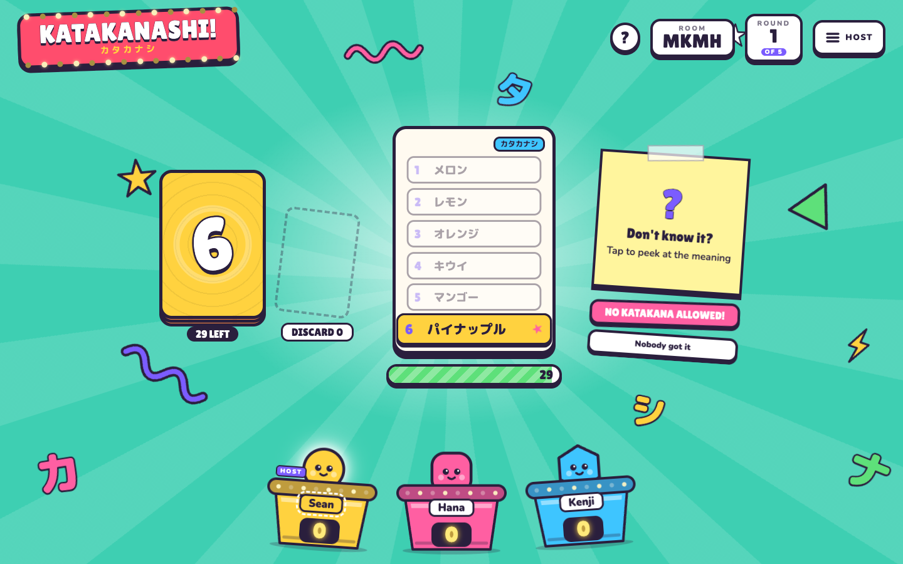

# Katakanashi Online

Katakanashi is a popular Japanese word/card game similar to Taboo - players
draw a card and have to describe the chosen katakana word, *without* using any
katakana words in their description, while other players try to guess.

Katakanashi Online is a web version of this game :-)

